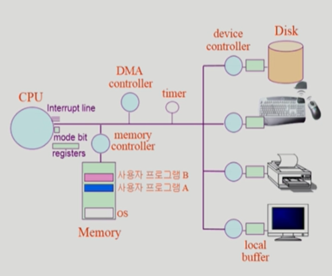
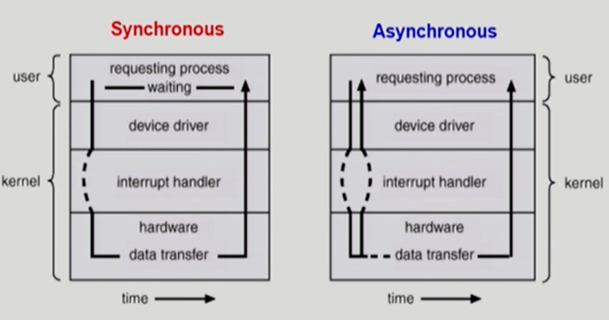
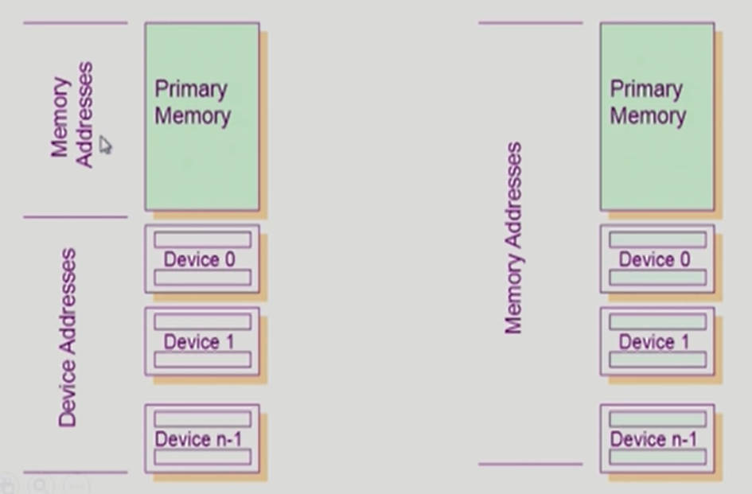
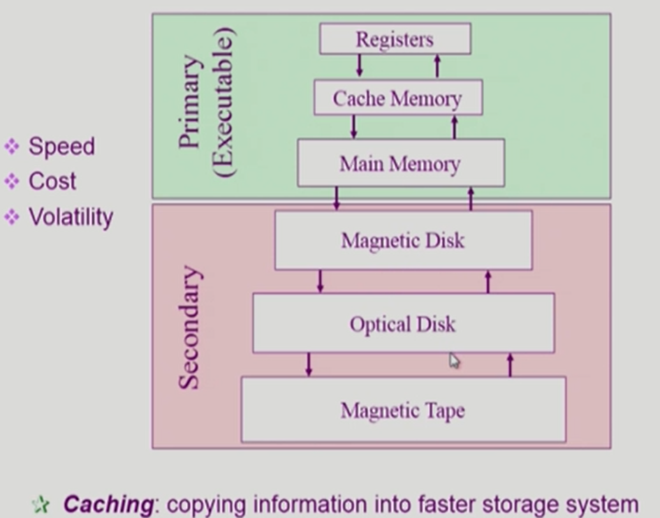
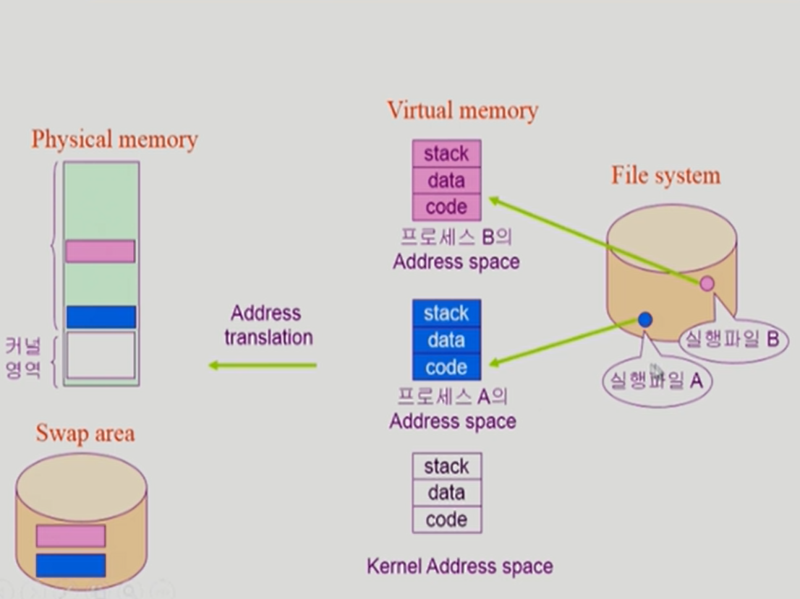
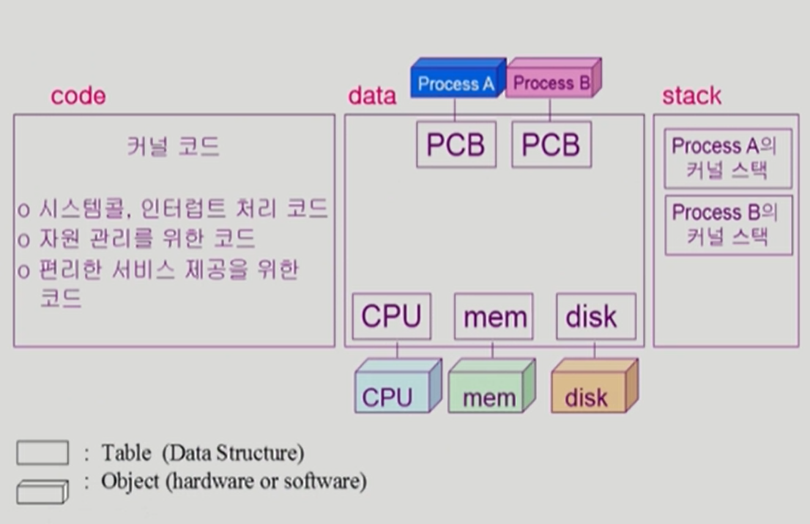
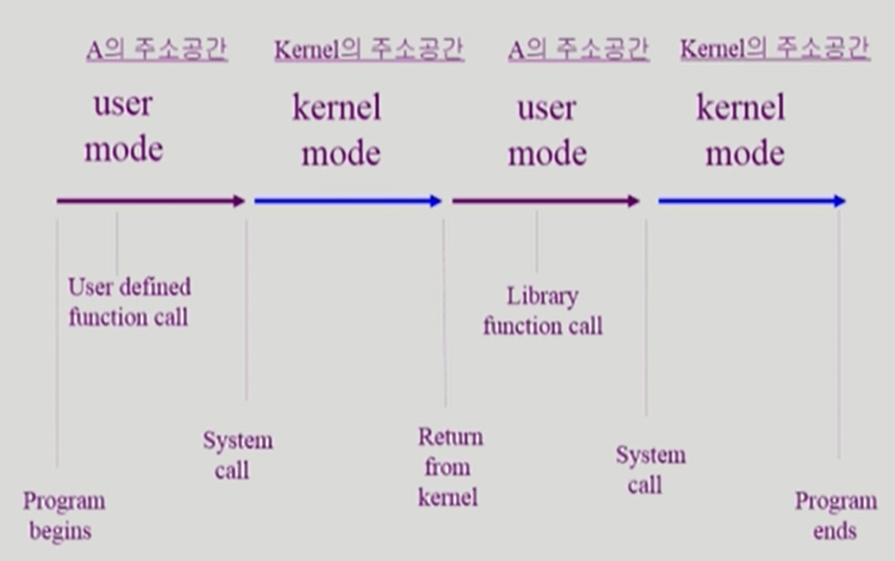

# System Structure & Program Execution

 

## 컴퓨터 시스템 구조

 device controller
- 각각의 I/O Device를 통제를 전담하는 작은 CPU역할을 하는 장치
- CPU의 메모리처럼 각각 작업공간을 갖고 있는데 **로컬 버퍼**라고 한다.
- CPU에 비해 매우 느리다.

registers
- CPU 내부의 memory보다 작으면서 정보를 저장하는 공간

mode bit
- CPU에서 실행되는 것이 운영체제인지 사용자 프로그램인지 구분

interrupt line
- I/O device에 직접 접근할 수 없기에 특정 작업이 마무리 되면 이 라인을 통해 연락

timer

- 무한루프의 프로그램이 혼자 CPU를 독점하는 것을 방지

운영체제와 입출력장치를 통해서만 CPU 접근 가능

 

## Mode bit

- 사용자 프로그램의 잘못된 수행으로 다른 프로그램 및 운영체제에 피해가 가지 않도록 하기 위한 보호 장치 필요
- mode bit을 통해 하드웨어적으로 두 가지 모드의 operation 지원
  - 1 사용자 모드 : 사용자 프로그램 수행, 0 모니터 모드 : OS 코드 수행
  - 보안을 해칠 수 있는 중요한 명령어는 모니터 모드에서만 수행 가능한 '특권명령'으로 규정
  - Interrupt나 Exception 발생시 하드웨어가 mode bit을 0으로 바꿈
  - 사용자 프로그램에게 CPU를 넘기기 전에 mode bit을 1로 셋팅

 

### Timer

- 정해진 시간이 흐른 뒤 운영체제에게 제어권이 넘어가도록 Interrupt를 발생시킴
- 타이머는 매 클럭 틱 때마다 1씩 감소
- 타이머 값이 0이 되면 타이머 인터럽트 발생
- CPU를 특정 프로그램이 독접하는 것으로부터 보호
- 타이머는 time sharing을 구현하기 위해 널리 이용됨

 

### Device Controller

- I/O device controller
  - 해당 I/O 장치유형을 관리하는 일종의 작은 CPU
  - 제어 정보를 위해 control register, status register를 가짐
  - local buffer를 가짐 (일종의 data register)
- I/O는 실제 device와 local buffer 사이에서 일어남
- Device controller는 I/O가 끝났을 경우 interrupt로 CPU에 그 사실을 알림
- device driver : OS 코드 중 각 장치별 처리 루틴 -> software
- device controller : 각 장치를 통제하는 일종의 작은 CPU -> hardware

 

### 입출력(I/O)의 수행

- 모든 입출력 명령은 특권 명령
- 사용자 프로그램은 어떻게 I/O를 하는가?
  - 시스템콜 : 사용자 프로그램은 운영체제에게 I/O 요청
  - trap을 사용하여 인터렙트 벡터의 특정 위치로 이동
  - 제어권이 인터렙트 벡터가 가리키는 인터럽트 서비스 루틴으로 이동
  - 올바른 I/O 요청인지 확인 후 I/O 수행
  - I/O 완료 시 제어권을 시스템콜 다음 명령으로 옮김

 

### 인터럽트(Interrupt)

- 인터럽트 당한 시점의 레지스터와 program counter를 save 한 후 CPU의 제어를 인터럽트 처리 루틴에 넘긴다.
- Interrupt : 하드웨어가 발생시킨 인터럽트
- Trap(소프트웨어 인터럽트)
  - Exception : 프로그램이 오류를 범한 경우
  - System call : 프로그램이 커널 함수를 호출하는 경우
- 인터럽트 벡터 : 해당 인터럽트의 처리 루틴 주소를 가지고 있음
- 인터럽트 처리 루틴(인터럽트 핸들러) : 해당 인터럽트를 처리하는 커널 함수

 

### 동기식 입출력과 비동기식 입출력

동기식 입출력(synchronous I/O)

- I/O 요청 후 입출력 작업이 완료된 후에야 제어가 사용자 프로그램에 넘어감
- 구현 방법 1
  - I/O가 끝날 때까지 CPU를 낭비시킴
  - 매시점 하나의 I/O만 일어날 수 있음(CPU,I/O 모두 낭비)
- 구현 방법 2
  - I/O가 완료될 때까지 해당 프로그램에게서 CPU를 빼앗음
  - I/O 처리를 기다리는  줄에 그 프로그램을 줄 세움
  - 다른 프로그램에게 CPU를 줌

비동기식 입출력(asynchronous I/O)

- I/O가 시작된 후 입출력 작업이 끝나기를 기다리지 않고 제어가 사용자 프로그램에 즉시 넘어감

*두 경우 모두 I/O의 완료는 인터럽트로 알려줌

 

### DMA(Direct Memory Access)

- 빠른 입출력 장치를 메모리에 가까운 속도로 처리하기 위해 사용
- CPU의 중재 없이 device controller가 device의 buffer stroage의 내용을 메모리에 block 단위로 직접 전송
- 바이트 단위가 아니라 block 단위로 인터럽트를 발생시킴

 

### 서로 다른 입출력 명령어

- I/O를 수행하는 special instruction에 의해
- Memory Mapped I/O에 의해

 

### 저장장치 계층 구조

- 위로 갈수록 속도는 빠르고 용량은 작음(고가)
- 연두색은 휘발성, 분홍색은 비휘발성
- primary가 CPU가 직접 접근하여 실행하는 영역

 

### 프로그램의 실행(메모리 load)

 

### 커널 주소의 내용

 

### 사용자 프로그램이 사용하는 함수

- 사용자 정의 함수 : 자신의 프로그램에서 정의한 함수
- 라이브러리 함수 : 자신의 프로그램에서 정의하지 않고 갖다 쓴 함수, 자신의 프로그램의 실행 파일에 포함되어 있다.

----- 프로세스 A의 Address space

- 커널 함수: 운영체제 프로그램의함수, 커널 함수의 호출 = 시스템 콜

------ Kernel Address space

 

### 프로그램의 실행

